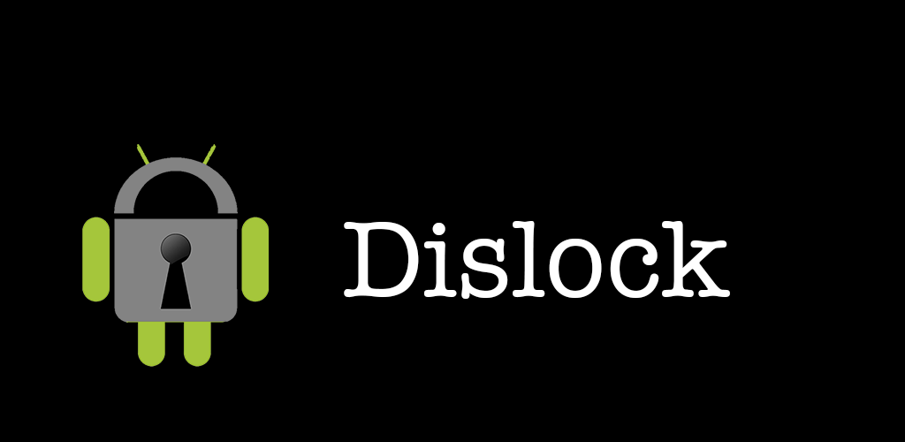

Dislock
=============

Dislock (formerly Pebble Locker) is an Android app that can control the state of your Android device's lock screen
without the need for root. Enjoy the use of your Android without a lock screen when your Pebble watch, selected
Bluetooth devices or Wifi networks are connected and the security of a lock screen when you walk away causing
your Pebble, other Bluetooth devices or Wifi networks to disconnect.

Available on the [Play Store](https://play.google.com/store/apps/details?id=com.lukekorth.pebblelocker)

## Device Support

Dislock supports:
* Pebble watches
* Bluetooth devices that maintain a constant connection and show up in your list of paired devices
* Android Wear
* Wifi networks (by SSID, multiple APs with the same SSID will be detected as a single network)
* Pattern lock

Dislock *does not* support:
* Bluetooth 4 (LE) devices like Fitbits

## Uninstalling

If you have activated the "Turn off screen on disconnect" option, to uninstall you must deactivate
Dislock as a device admin either in Dislock or in your device's menu. You may or may not need to reboot
your device to uninstall Dislock after disabling it as a device admin.

## Additional Info

Read more and comment on the [blog post](http://lukekorth.com/blog/pebble-locker/)

## License

Dislock is open source and available under the MIT license. See the [LICENSE](LICENSE) file for more info.
